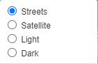
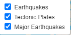
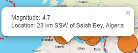
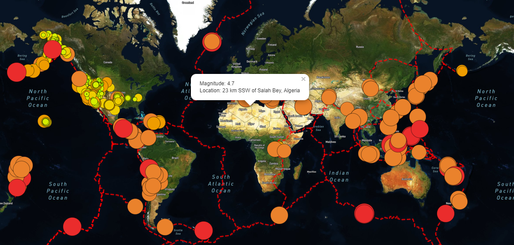

# Overview of Project:

The purpose of this project is to visually show earthquakes and their relation to the tectonic plates on the earth, for a period of the last seven previous days. 
Our problematic is how to retrieve GeoJson earthquake data from open-sources website and then showcase our finding on an interactive map containing multiple layers giving access to different information. 

# Results: 

To complete our project, we retrieve GeoJson data from various sources and using JavaScript with Leaflet and Mapbox libraries, add this data to interactive map. 
We can choose between four different tile layers:
- Streets layer.
- Streets Satellite layer.
- Light layer.
- Dark layer.

 
We also have the choice to display different maps:
- All earthquakes around the world from the last seven days.
- Relation between earthquakes and tectonic plates.
- All earthquakes around the world with a magnitude greater than 4.5.

 
Each earthquake is represented by a circle marker changing color and size based on his magnitude. A pop-up marker, if click upon will display the magnitude of the event as well as his location. 

 
Each dataset can be toggled on and off in the webpage and adapted legends are display as well.

# Summary:

The map showcase earthquakes information from the previous seven days on earth as well as their relation with tectonic plates. 
A specific map showing only earthquakes with a magnitudes superior at 4.5 is also available.

